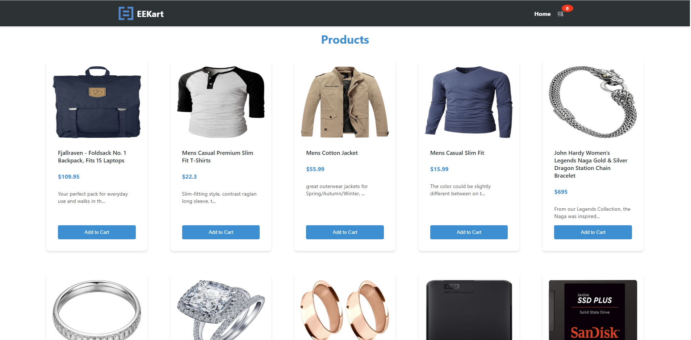
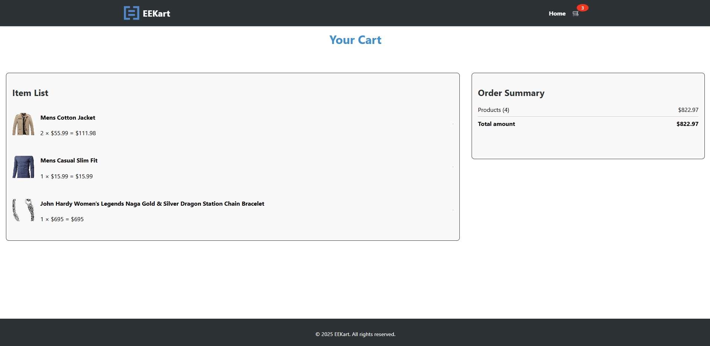

 ## :warning: Please read these instructions carefully and entirely first
* Clone this repository to your local machine.
* Use your IDE of choice to complete the assignment.
* When you have completed the assignment, you need to  push your code to this repository and [mark the assignment as completed by clicking here](https://app.snapcode.review/submission_links/b52ae932-669c-4908-bc1d-4e640e74ceb5).
* Once you mark it as completed, your access to this repository will be revoked. Please make sure that you have completed the assignment and pushed all code from your local machine to this repository before you click the link.

# About the task

We’ll be creating a PLP (Product Listing Page), similar to those used by e-commerce websites, as the domain for this problem.

There’s no time limit for this task but If you are careful with the scope we expect it to be possible to complete this task in about 2 hours. It’s reasonable to include some text in the readme describing where you would have gone with more time.

## Tips on what we’re looking for

### 1. Well Tested Solution

Your solution should have good automated tests.

### 2. Simplicity

We value simplicity as an architectural virtue and a development practice. Solutions should reflect the difficulty of the assigned task, and should not be unnecessarily complex. 

### 3. Approach

We are open to any framework of choice.  Please approach this as you would any other work task.

### 4. Self-explanatory code

The solution you produce must speak for itself. Multiple paragraphs explaining the solution is a sign that the code isn’t straightforward enough to understand on its own.

### 5. Dealing with ambiguity

If there’s any ambiguity, please add this in a section at the bottom of the README. You should also make a choice to resolve the ambiguity.

# Begin the task

Create a Product Listing Page (PLP) page which will be responsible for:

1. Rendering of a list of products from the api. https://equalexperts.github.io/frontend-take-home-test-data/products.json

2. Each product tile should show the product information from the api:
- Product Image
- Title
- Price
- Description

3. Add to Cart Button
- Users should be able to click on the Add to Cart button multiple times. 
- As the customer adds the item, it should update and show on the cart.
- Each item in the Cart should show the quantity of that particular item.
- The cart should show the price of each item multiplied by the quantity.

4. The application should be consistent with EqualExperts Branding.

5. We are looking for a clean, professional and accessible web app which works on all the different screen sizes.

# AI Tool Usage

While we encourage the use of AI tools as part of the learning process but to ensure transparency, please provide the following information regarding the use of AI tools in this submission:

1.  **Specific Use Cases:** Describe for what purposes tool was used (e.g., code generation, debugging assistance, query generation etc.).
2.  **Percentage of Code Generated by AI:** Provide an estimate of the percentage of the submitted code that was generated by AI.
3.  **How AI-Generated Code Was Reviewed:** Explain how you reviewed and verified the AI-generated code to ensure its correctness and quality.

Please note, during the technical interview, which will build upon this exercise, we'll focus on your coding abilities and problem-solving skills without the use of AI tools. This will allow us to see your direct approach and thought process.

Good luck…

# How to run the code

In the project directory, you can run the following commands:
---
### `npm start`

Runs the app in **development mode**.
Open [http://localhost:3000](http://localhost:3000) to view it in your browser. The page will reload when you make changes.

### `npm test`
Launches the **test runner** in the interactive watch mode.

## Testing
### `npx cypress open`

Opens the **Cypress Test Runner** for end-to-end (E2E) testing.

## About AI Tool
I have not used any AI tool for development but did some googling for css styling.

## Screenshots

